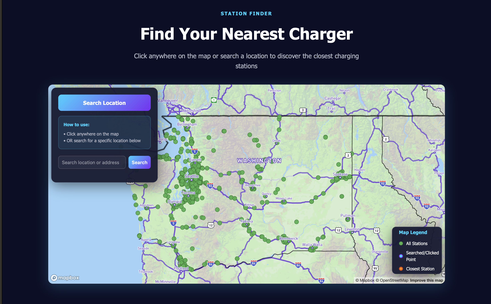
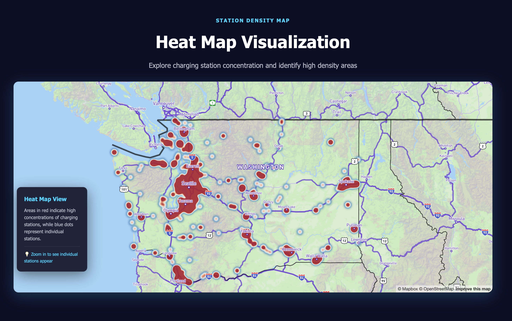

# Washington EV Charging Hub

**Group AC3:** 
- Omar Ahmad
- Margaret Jou
- Jiali Deng
- Johann Ravindranathan

## Project Description
Our project aims to create an interactive mapping platform that visualizes the distribution of electric vehicle charging stations across Washington State. It is designed for a wide range of users, including shoppers researching electric vehicles, current EV owners looking for charging locations, long-distance travelers planning routes, and city planners or business owners examining infrastructure needs. The website is organized into four main sections: a statewide map of public charging stations, a tool for finding the nearest chargers, a density map that highlights areas with higher or lower charger availability, and a page that provides educational information about Washington’s public EV charging network. Together, these features create a clear and accessible resource for understanding and navigating EV charging across the state.

## Favicon

## Project Goals
The goal of this project is to help users understand and explore the availability of electric vehicle charging infrastructure in Washington State. By visualizing charging station locations and providing tools to search, compare, and analyze this information, it helps make EV charging more accessible, support informed decision making, and highlight patterns or gaps in the current charging network.

## Application URL
**Link to Map:**
[Washington EV Charging Hub](https://jrav2.github.io/EV_Charger_Mapping/)

## Screenshots
### Homepage:

### All Stations: 

### Station Finder:

### Station Density Map: 

## Main Functions

**All Stations Page**

- Display all EV charging stations across Washington State on an interactive map
- Color-coded stations by charger type (Level 1, Level 2, DC Fast Charging)
- Click integration for all stations marker to view detailed information (name, address, charger type)
- Informational section explaining the three charger types and their charging speeds
- Legend showing what each color represents

**Station Finder Page**

- Click anywhere on the map to list the 5 closest charging stations
- Search for a specific location or address using the search bar
- Display distance from your selected point to nearby stations
- Show detailed station information (name, address, phone, hours, distance)
- Visual markers distinguish between your clicked location (blue), all stations (green), and the closest station (orange)
- Sidebar listing with clickable station cards that fly to the station on the map

**Station Density Map Page**

- Heat map visualization showing concentration of charging stations
- Color gradient from blue (low density) to red (very high density)
- Identify areas with abundant charging infrastructure vs. underserved regions
- Zoom in to transition from heat map view to individual station markers
- Click on individual stations (when zoomed in) to see station details
- Helpful for understanding charging coverage across the state

**General Features Across All Pages**

- Fully responsive design for desktop, tablet, and mobile devices
- Dark UI theme 
- Consistent navigation bar for easy page switching
- Mapbox integration for smooth, interactive map experiences

## Data Sources
**NOTE: SOMETIMES TO ACCESS THESE DATASETS YOU MUST COPY AND PASTE THE LINK INTO THE WEB BROWSER MANUALLY, CLICKING IT OFF OF THE README FILE MAY NOT ALWAYS WORK**
- Primary Download Source:
Public EV Charging Stations dataset from the Washington Geospatial Open Data Portal (To access please scroll down and press the source link for *EV Charging Stations* which is under **EV Charging Stations 1,928**)
https://geo.wa.gov 

- Original Data Provider:
Washington State Department of Transportation ArcGIS REST Feature Server
https://services.arcgis.com/jsIt88o09Q0r1j8h/arcgis/rest/services/Public_EV_Charging_Stations/FeatureServer/0

- ArcGIS Map Viewer Version of the Dataset:
Interactive map view of the same ArcGIS data
https://www.arcgis.com/apps/mapviewer/index.html?url=https://services.arcgis.com/jsIt88o09Q0r1j8h/ArcGIS/rest/services/Public_EV_Charging_Stations/FeatureServer/0&source=sd

## Applied Libraries
Our project makes use of several modern web libraries and online services to build an interactive and responsive EV charging visualization platform. Mapbox GL JS and Leaflet are applied for mapping and geospatial visualization, allowing us to render dynamic map tiles, style layers, and display more than one thousand charging station points with smooth interaction. The application also uses the Mapbox basemap service to provide high-quality map backgrounds and geocoding capabilities for location searches. Data for the charging stations is accessed from the Washington Geospatial Open Data Portal and the ArcGIS REST Feature Server, enabling real-time retrieval of accurate spatial data. Additionally, GitHub is used for version control and web hosting, allowing the site to be easily updated and shared.

## Acknowledgements
At this time we would like to acknowledge:
  - Mapbox
  - VSCode
  - Github
  - Turf.js
  - ChatGPT
  - Claude.ai
  - Github Copilot

We would like to give special thanks to:
  - Professor Zhao
  - Alex Kirchmeier
  - Feedback and comments from Geography 328 classmates

Images were from:
- https://encrypted-tbn0.gstatic.com/images?q=tbn:ANd9GcSSOrgYGXSYV61AaicvsRgalDkma4LkyGbvlA&s (Greedo Image)
- https://wallpapers-clan.com/wp-content/uploads/2022/10/lego-star-wars-pfp-1.jpg (Revan Image)
- https://flipanim.com/gif/r/e/REFhK8xT.gif (Yoda Image)
- https://i.scdn.co/image/ab67616d0000b2736455942e671fc3593e33dfc7 (Jar Jar Image)

## AI Use Dislosure
This project leveraged ChatGPT and GitHub Copilot to help with coding in unfamiliar areas and to help us explore our stylistic options. We used these programs for frontend development, such as adapting our CSS. It helped us create a modern, responsive design that included glassmorphic effects and gradient backgrounds. AI assisted us in integrating JavaScript functions such as distance calculations, geocoding, event handling, and popup displays. These were elements we first implemented, and then used AI tools to help in debugging and to optimize the code. All major design decisions about the project, including concepts, data, features, and style, were made by the team.

## Additional Notes
This webpage is a prototype design made for our Geography 328 Final Project. To this end, we incorporate several tutorial-based elements as well as AI assistance to compose our functions, page structure, and features. In creating this project we hoped to explore the possibilities of an application based on Electric Vehicle Charging Infrastructure information. If this project is used for more official purposes, we would like to expand our design language and improve our offered features. 
