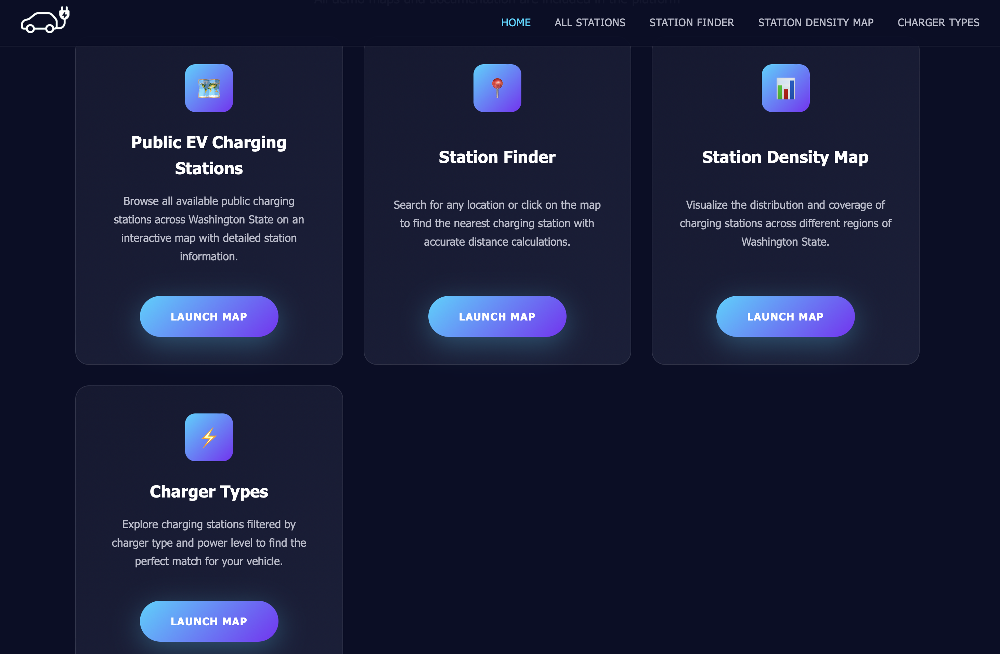
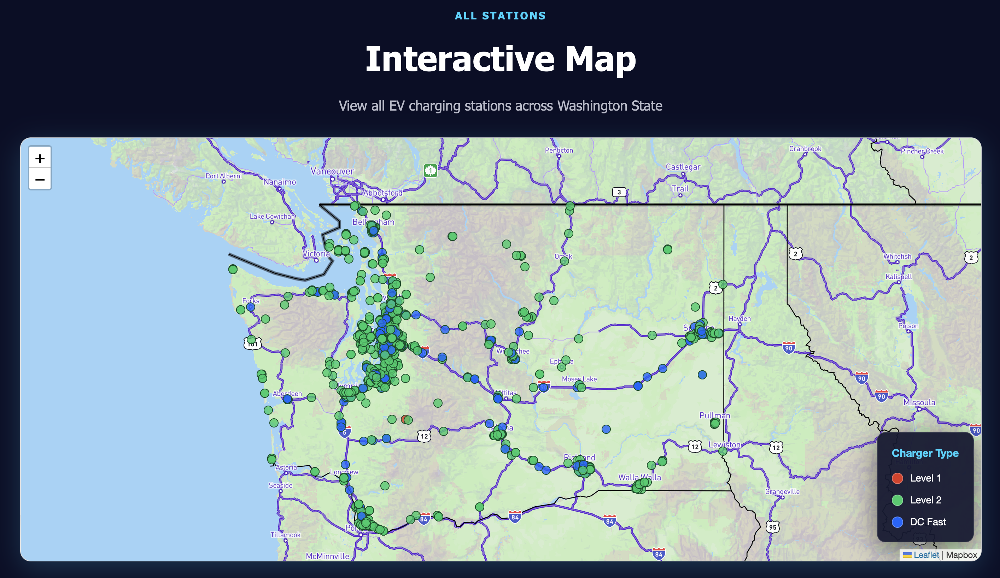
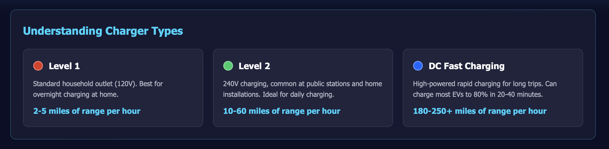
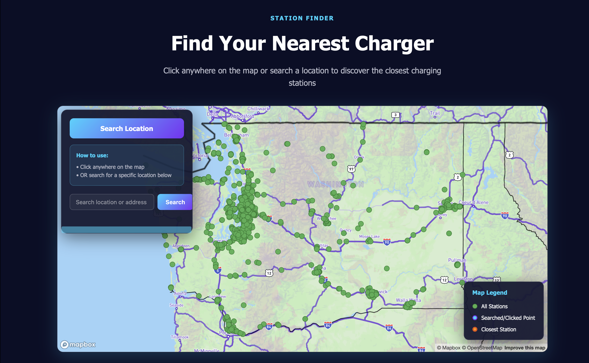
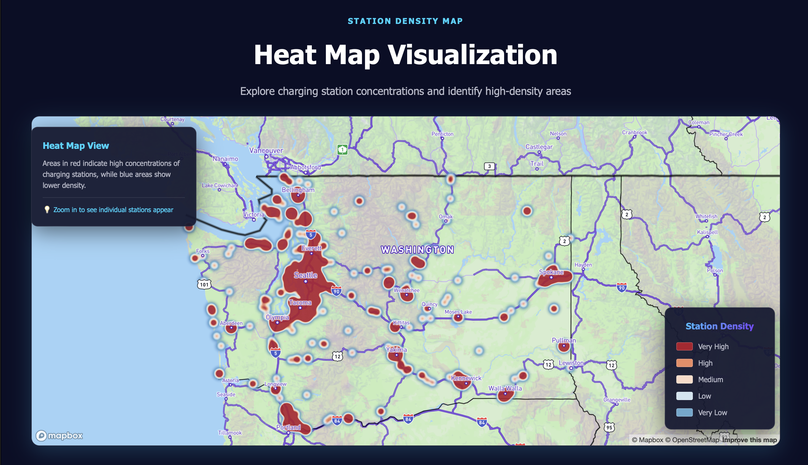

# Washington EV Charging Hub

**Group AC3:** 
- Omar Ahmad
- Margaret Jou
- Jiali Deng
- Johann Ravindranathan

## Project Description
Our project aims to create an interactive mapping platform that visualizes the distribution of electric vehicle charging stations across Washington State. It is designed for a wide range of users, including shoppers researching electric vehicles, current EV owners looking for charging locations, long-distance travelers planning routes, and city planners or business owners examining infrastructure needs. The website is organized into four main sections: a statewide map of public charging stations, a tool for finding the nearest chargers, a density map that highlights areas with higher or lower charger availability, and a page that provides educational information about Washington’s public EV charging network. Together, these features create a clear and accessible resource for understanding and navigating EV charging across the state.

## Favicon

## Project Goals
The goal of this project is to help users understand and explore the availability of electric vehicle charging infrastructure in Washington State. By visualizing charging station locations and providing tools to search, compare, and analyze this information, it helps make EV charging more accessible, support informed decision making, and highlight patterns or gaps in the current charging network.

## Application URL
**Link to Map:**
(insert the link to the map)

## Screenshots
### Homepage:

### All Stations: 

### Station Finder:

### Station Density Map: 

## Main Functions

**All Stations Page**

- Display all EV charging stations across Washington State on an interactive map
- Color-code stations by charger type (Level 1, Level 2, DC Fast Charging)
- Click on any station marker to view detailed information (name, address, charger type)
- Educational section explaining the three charger types and their charging speeds
- Legend showing what each color represents

**Station Finder Page**

- Click anywhere on the map to find the 5 closest charging stations
- Search for a specific location or address using the search bar
- Display distance calculations from your selected point to nearby stations
- Show detailed station information (name, address, phone, hours, distance)
- Visual markers distinguish between your clicked location (blue), all stations (green), and the closest station (orange)
- Sidebar listing with clickable station cards that fly to the station on the map

**Station Density Map Page**

- Heat map visualization showing concentration of charging stations
- Color gradient from blue (low density) to red (very high density)
- Identify areas with abundant charging infrastructure vs. underserved regions
- Zoom in to transition from heat map view to individual station markers
- Click on individual stations (when zoomed in) to see station details
- Helpful for understanding charging coverage across the state

**General Features Across All Pages**

- Fully responsive design for desktop, tablet, and mobile devices
- Dark UI theme 
- Consistent navigation bar for easy page switching
- Mapbox integration for smooth, interactive map experiences

## Data Sources
**NOTE: TO ACCESS THESE DATASETS YOU MUST COPY AND PASTE THE LINK INTO THE WEB BROWSER MANUALLY, CLICKING IT OFF OF THE README FILE WILL NOT WORK**
- Primary Download Source:
Public EV Charging Stations dataset from the Washington Geospatial Open Data Portal (To access please scroll down and press the source link for *EV Charging Stations*)
https://geo.wa.gov 

- Original Data Provider:
Washington State Department of Transportation ArcGIS REST Feature Server
https://services.arcgis.com/jsIt88o09Q0r1j8h/arcgis/rest/services/Public_EV_Charging_Stations/FeatureServer/0

- ArcGIS Map Viewer Version of the Dataset:
Interactive map view of the same ArcGIS data
https://www.arcgis.com/apps/mapviewer/index.html?url=https://services.arcgis.com/jsIt88o09Q0r1j8h/ArcGIS/rest/services/Public_EV_Charging_Stations/FeatureServer/0&source=sd

To update our local repositories using the cmd prompt, see 
[Lab 1 Instructions](https://github.com/jakobzhao/geog328/tree/main/labs/lab01)

On Windows, can use the following commands on repository root: 
**git checkout --force** and **git pull**

https://geo.wa.gov
